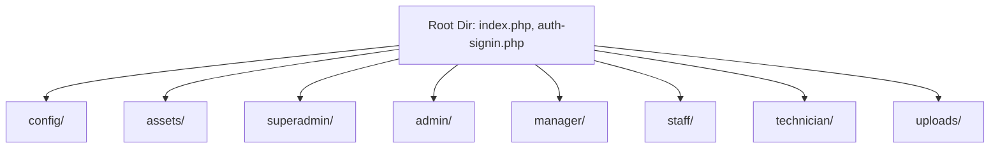

# Lead Management
The lead management project are development for managing lead of customer for followups.

# Project report
# Project Analysis Report: Kesya Lead Management

Kesya Lead Management (formerly Kesya CRM / Azuprawa CRM) is a feature-rich, role-based Lead Management system written in PHP and powered by a MySQL database. It supports multi-tenant concepts (companies and branches) and enforces precise access levels using dynamic permissions.

---

## 🏛️ System Architecture & Folder Structure

The application separates its core business modules and dashboards by splitting code into clean role-based subdirectories.



### 📂 Directory Walkthrough

*   **`config/`**: Houses key database configurations, session monitors, activity logging utilities, and the background notification processor.
*   **`superadmin/`**: High-level administrative panel capable of creating/editing companies, global branches, employee profiles, and system configurations.
*   **`admin/`**: Tenant-specific administrative environment with full control over the respective company's branches, state-lists, employees, customers, products, and lead transfers. Also contains the Permission Controller.
*   **`manager/`**: Branch-level dashboard enabling regional staff tracking, lead assignments, product catalog visibility, and customer relationship monitoring.
*   **`staff/`**: Sales and operations workplace designed to create leads, register clients, manage personal/delayed follow-ups, and review performance reports.
*   **`technician/`**: Dedicated environment for field engineers. It facilitates tracking assigned installations, recording service parameters, and uploading signed agreements.
*   **`uploads/`**: Stores uploaded profile pictures, company icons, product worksheets, and client installation agreement documents.

---

## 🔑 Core Authentication & Permissions Engine

The application handles roles dynamically by combining immediate routing triggers, session validators, and dynamic database permissions.

### 🔄 Dynamic Role-Routing (`index.php`)
When a user logs in, `index.php` processes the active session role using a mapped redirect array:

```php
$role_redirects = [
    'Staff'       => 'staff/index.php',
    'Technician'  => 'technician/index.php',
    'Manager'     => 'manager/index.php',
    'Admin'       => 'admin/index.php',
    'Super Admin' => 'superadmin/index.php'
];
```

### 🛡️ Dynamic Permissions Configuration
Menu accessibility is governed by the `permissions` table. In files like `staff/sidenav.php`, the system queries permission configurations on the fly and sets conditional visibility variables:

```php
$FetchPermission = "SELECT `permission_options`, `permission_assign_to` 
                    FROM `permissions` 
                    WHERE `permission_status` = '1' AND `permission_assign_to` LIKE '%Staff%'";
```

Based on this logic, sections such as **State Lists**, **Users Control**, **Product Control**, **Leads Control**, and **Reports** are conditionally loaded:

```php
<?php if ($Leads_Control): ?>
    <li class="nav-item">
        <a class="nav-link menu-arrow" href="#sidebarLeadsControl" ...>
            <span class="nav-text">Leads Control</span>
        </a>
    </li>
<?php endif; ?>
```

---

## 💼 Business Workflows & State Machines

### 📋 Lead Lifecycle
Leads transition through multiple administrative and sales phases:
1.  **Creation / Import**: Admin/Manager uploads Excel worksheets using `PhpSpreadsheet` or enters leads manually in `lead-new.php`.
2.  **Assignment**: Managers assign leads to staff members.
3.  **Follow-up State Machine**: Staff schedules meetings, updates feedback, and updates status categories:
    *   `All Followups`
    *   `Today's Visits`
    *   `Today's Followups`
    *   `Upcoming Followups`
    *   `Delayed Followups`
    *   `Cancelled Followups`
    *   `Completed / Placed Orders`
4.  **Transferring**: Administrators can move leads between branches or staff pools in `lead-transfer.php` to prevent stale queues.

### 🔧 Installation Workflow (Field Technicians)
Once an order/lead status updates to `Completed`, field engineers are dispatched:
*   Technicians track installations via `installations.php` (`Today's`, `Upcoming`, `Missed`, and `Completed`).
*   They capture client agreement paperwork, storing digital versions in `../uploads/agreement/`.
*   They register system parameters and finalize completion tags via `installation-update.php`.

### 🔔 Real-time Notifications Engine (`config/fornotification.php`)
An automated client-side polling mechanism queries `fornotification.php` containing the active datetime:
*   It calculates immediate or overdue interactions by querying:
    ```sql
    `lead_next_followup_date` < '$currentDate' OR (`lead_next_followup_date` = '$currentDate' AND `lead_next_followup_time` <= '$currentTime')
    ```
*   Provides role-filtered feedback alerts (Super Admin monitors all queues; managers watch branch employees; staff sees self-assigned items).

---

## 💾 Database Schema Overview

Based on code-base queries and system logs, the key tables include:

| Table Name | Primary Purpose | Key Fields |
| :--- | :--- | :--- |
| **`employees`** | User credentials and profile mapping | `id`, `employee_name`, `employee_of_company`, `employee_of_branch`, `employee_user_role`, `employee_status`, `profile_pic`, `employee_username`, `employee_user_password` |
| **`leads`** | Heart of client records and followups | `id`, `lead_customer_name`, `lead_customer_contact`, `lead_whatsapp`, `lead_type`, `lead_next_followup_date`, `lead_next_followup_time`, `assign_technician`, `lead_instalation_aggreement`, `lead_customer_status` |
| **`permissions`** | Access control settings | `id`, `permission_id`, `permission_options`, `permission_assign_to`, `permission_status` |
| **`branches`** | Office locations | `branch_id`, `branch_name`, `branch_of_company`, `branch_status` |
| **`companies`** | Multi-tenant groups | `company_id`, `company_name`, `company_status` |
| **`settings`** | Global application variables | `id`, `setting_status` (Maintenance mode toggle) |
| **`products`** | Inventory items | `id`, `product_name`, `product_for_company`, `status` |
| **`activities`** | Traceable user audit trail | `id`, `activity_action`, `activity_by`, `activity_company`, `activity_branch` |
| **`alertnotes`** | Operational news alerts | `id`, `alert_title`, `alert_message`, `alert_date`, `alert_status` |

---

## 🎨 Frontend Presentation & Aesthetics

The application boasts a premium, high-fidelity responsive dashboard design:
*   **Grid.js Powered Tables**: Leverages Grid.js for fast, client-side searchable, pageable, and sorting tabular views with elegant custom styled headers (`#ff6c2f`).
*   **Solar Icons**: Leverages dynamic `<iconify-icon>` wrappers with gradient/duotone accents to visually delineate sections.
*   **Interactive Components**: Includes toggle switches for immediate status publishing, password show/hide triggers, auto-dismissing bootstrap alerts, and loading spinners on form submissions for polished user feedback.

---

## 🛡️ Security & Performance Enhancements Added

> [!TIP]
> **Unified UI "Lead Management" Renaming**
> Renamed all occurrences of the visual display title "CRM" to "Lead Management" inside all user interface templates (login sheets, planned maintenance screens, HTML head descriptions, and notification systems). This preserves all underlying database bindings while presenting a consistent business brand.

> [!TIP]
> **FontAwesome Icon Library Integration**
> Standardized all header files (`head.php`) to load the official FontAwesome CDN. This restores all missing input icons (username, password), form validation elements, and password show/hide toggle visual cues, ensuring a premium visual signature.

> [!TIP]
> **Superadmin Stylesheet Render Correction**
> Fixed a critical HTML syntax issue in `superadmin/head.php` where stylesheet declarations (icons, layout themes, and own styles) were missing the `rel="stylesheet"` attribute, causing browsers to refuse styling rules. Correcting this fully restores the Super Admin dashboard layouts.

> [!TIP]
> **Robust File Inclusions (`__DIR__`)**
> Refactored all relative inclusion statements inside the core `config/` files to absolute path lookups via `__DIR__`. This resolves dynamic path vulnerabilities and eliminates file resolution warnings when system files are loaded across various subdirectory levels.

> [!TIP]
> **Dynamic SQL Injection Prevention**
> Dynamic session values (`$_SESSION['employee_username']`) and real-time polling elements (`$_POST['CurrentDateAndTime']`) inside `config/session.php` and `config/fornotification.php` are now safely sanitized via `mysqli_real_escape_string()`.

> [!TIP]
> **Notification Engine Query Optimization (Index Friendly)**
> Resolved notification bottleneck by replacing slow, table-scanning `CONCAT(date, ' ', time) <= '$currentDateTime'` logic with discrete comparative fields:
> ```sql
> (`lead_next_followup_date` < '$currentDate' OR (`lead_next_followup_date` = '$currentDate' AND `lead_next_followup_time` <= '$currentTime'))
> ```
> This optimization allows the database to instantly access index trees on date/time fields, ensuring maximum speed regardless of lead growth.
